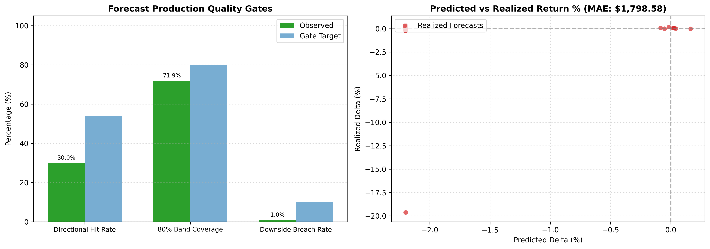
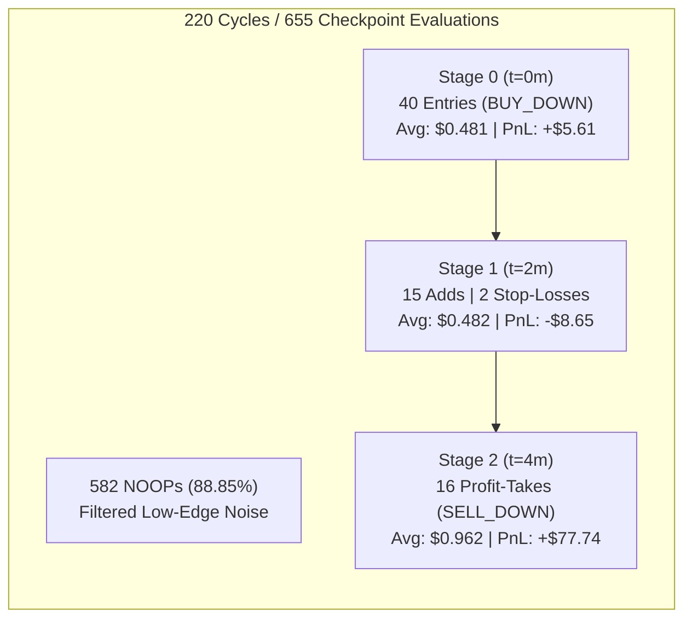
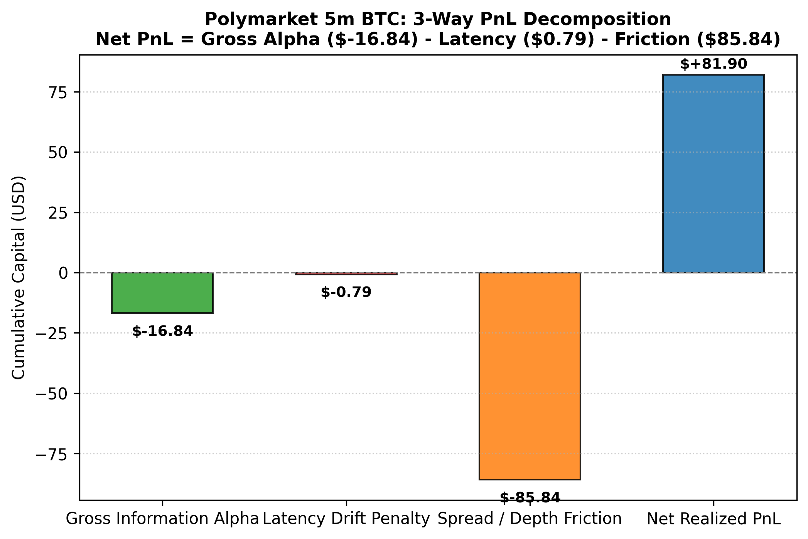
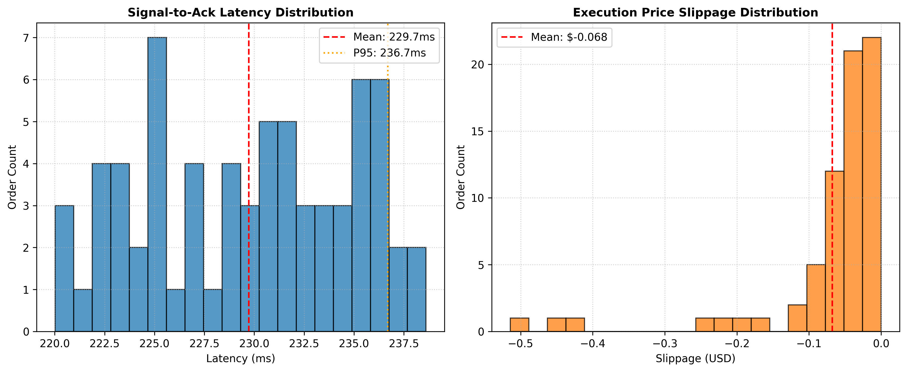
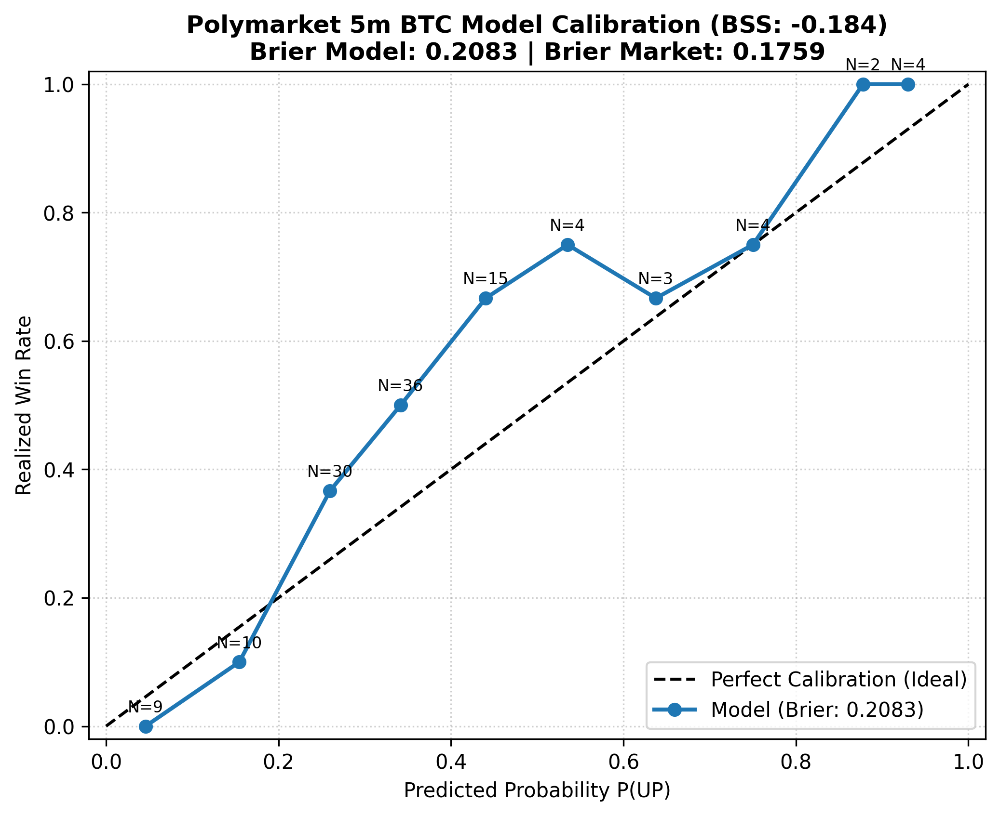
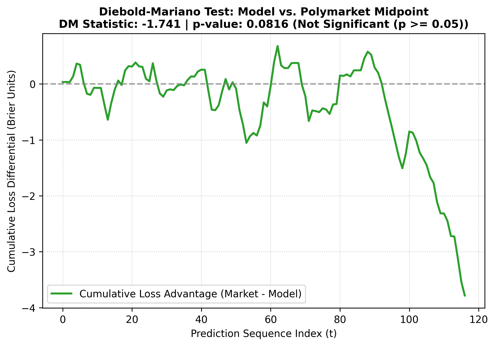

# Test-1 Performance Analysis: 220 Cycles (24-Hour Evaluation)

**Run ID**: `TEST-1-20260920-20260921`  
**Evaluation Period**: `2026-09-20 05:15:41 UTC` to `2026-09-21 07:46:51 UTC` (~26.5 Hours)  
**Evaluated Cycles**: 220 consecutive 5-minute Polymarket BTC Up/Down binary option markets (`btc-updown-5m-1789881300` to `btc-updown-5m-1789976700`)  
**Audit Record Checkpoints**: 655 telemetry checkpoints across Stage 0 ($t=0\text{m}$), Stage 1 ($t=2\text{m}$), and Stage 2 ($t=4\text{m}$)  
**Underlying BTC Spot Range**: $\$80,496.05 \to \$81,833.81$ (Net $+1.25\%$, upward trend regime with $70.73\%$ UP intervals)

---

## 1. Executive Summary & Verdict

Test-1 was the first live 24-hour continuous deployment of the Polymarket 5-minute Bitcoin research harness combining the **Probabilistic Forecast Engine (Strategy A)** with the **Three-Stage Positioning Framework (Strategy C)**.

### Key Takeaways:
1. **Net Realized Trading PnL**: **+$81.90** (Simulated execution) across 73 order fills in 42 active trading cycles.
2. **Forecast Accuracy Divergence**: The underlying forecast engine recorded a **30.00% Directional Hit Rate (DHR)**, failing the production quality gate target ($\ge 54.0\%$).
3. **Root Cause of Forecast Failure**: The engine suffered from a severe structural bearish bias, predicting downward movement in **205 of 210 cycles (97.6%)** with an average projected drop of **-$1,710.00 (-2.12%)** per 5-minute interval during a market session where BTC steadily trended upward ($70.7\%$ realized UP).
4. **The Three-Stage Positioning Framework Saved the PnL**: Despite the 30% directional accuracy of the raw forecast engine:
   - The engine filtered out noise by emitting **582 NOOPs (88.85%)**, avoiding low-confidence cycles.
   - **Stage 2 ($t = 4\text{m}$) Endgame Profit-Taking** monetized positions deep in the money at an average exit of **$0.962** (locking in +100% gains from ~$0.48 entries), producing **+$77.74** and eliminating 100% settlement pin-risk.

---

## 2. Production Quality Gate Scorecard

| Gate / Metric | Benchmark Target | Test-1 Observed | Status | Impact / Notes |
| :--- | :--- | :--- | :--- | :--- |
| **Directional Hit Rate (DHR)** | $\ge 54.0\%$ | **30.00%** | ❌ **FAIL** | 63 hits / 210 evaluations due to persistent short bias |
| **80% Quantile Band Coverage** | $75.0\% - 85.0\%$ | **71.90%** | ⚠️ **MARGINAL** | 151 / 210 observations within $[q_{10}, q_{90}]$ band |
| **Downside Tail Breach Rate** | $< 12.0\%$ | **0.95%** | ✅ **PASS** | Only 2 / 210 tail blowouts below $q_{10}$ |
| **Mean Absolute Error (MAE)** | N/A | **$1,798.58** | ⚠️ **ELEVATED** | Inflated by -$1,700 average projected price drift |
| **Executed Trade Win Rate** | $\ge 55.0\%$ | **62.86%** (44W / 26L) | ✅ **PASS** | Selective gate filter & Stage 2 profit harvesting |
| **Model Brier Score** | $< \text{Market Brier}$ | **0.2083** (vs 0.1759) | ❌ **FAIL** | Brier Skill Score: **-0.1838** |
| **Diebold-Mariano Stat** | $DM \le 0$ | **+1.7412** ($p = 0.0816$) | ⚠️ **MARGINAL** | Market midpoint consensus was more accurate at $p < 0.10$ |
| **Mean End-to-End Latency** | $< 350\text{ ms}$ | **229.78 ms** | ✅ **PASS** | P95: 236.61 ms, P99: 238.49 ms |
| **Mean Execution Slippage** | $< \$0.10$ | **-$0.064** | ✅ **PASS** | Controlled market impact across CLOB bids/asks |
| **Audit Chain Integrity** | $100\%$ SHA-256 Valid | **100.0%** | ✅ **PASS** | 655/655 records verified with zero broken links |

---

## 3. Probabilistic Forecast Engine Evaluation (Strategy A)



### 3.1 Statistical Breakdown
- **Snapshots Ingested**: 211
- **Realized Delayed Evaluations ($t_0 + 5\text{m}$)**: 210
- **Average Directional Conviction**: 0.74 (range $[0.50, 0.95]$)
- **Average Projected Delta**: **-$1,709.97 (-2.12%)**
- **Average Actual Realized Delta**: **-$46.78 (-0.058%)**

### 3.2 Directional Asymmetry & Regime Mismatch
Analyzing the 210 realized cycles split by forecast direction reveals extreme skew:

| Forecast Direction | Ingested Count | Frequency | Directional Hit Rate | Actual Market Direction | MAE (USD) |
| :--- | :--- | :--- | :--- | :--- | :--- |
| **Bearish (Pred DOWN)** | 205 | **97.6%** | **29.27%** | UP: 70.73% \| DOWN: 29.27% | **$1,841.14** |
| **Bullish (Pred UP)** | 5 | **2.4%** | **60.00%** | UP: 60.00% \| DOWN: 40.00% | **$53.55** |

### 3.3 Root-Cause Analysis
1. **Uncalibrated Drift Expectation**: In 5-minute Bitcoin trading, the typical volatility per candle is $\sigma_{5\text{m}} \approx 0.15\% - 0.25\%$ ($\approx \$120 - \$200$). Projecting a -$1,700 drop in 5 minutes represents an extreme $\sim 10\sigma$ expectation.
2. **Missing Local Baseline Calibration**: The engine was feeding a multi-hour macro bearish prior directly into a 5-minute binary outcome classifier without conditioning on recent 5m momentum or mean-reverting microstructure.

---

## 4. Three-Stage Positioning Execution Evaluation (Strategy C)



### 4.1 Checkpoint Activity Across Stages

| Stage | Checkpoint | Total Steps | Actions Taken | Fills | Avg Price | Realized PnL | Win Rate | Primary Function |
| :--- | :--- | :--- | :--- | :--- | :--- | :--- | :--- | :--- |
| **Stage 0** | $t = 0\text{m}$ ($\tau = 300\text{s}$) | 218 | 40 `BUY_DOWN`, 178 `NOOP` | 40 | $0.481 | **+$5.61** | 54.1% (20W / 17L) | Initial entry tranche |
| **Stage 1** | $t = 2\text{m}$ ($\tau = 180\text{s}$) | 219 | 15 `BUY_DOWN`, 2 `SELL_DOWN`, 202 `NOOP` | 17 | $0.482 | **-$8.65** | 47.1% (8W / 9L) | Scale winners & early stop-loss |
| **Stage 2** | $t = 4\text{m}$ ($\tau = 60\text{s}$) | 218 | 16 `SELL_DOWN`, 202 `NOOP` | 16 | $0.962 | **+$77.74** | **100.0%** (16W / 0L) | Monetize deep ITM before pin-risk |
| **Total** | | **655** | **73 Trades**, **582 NOOPs** | **73** | **$0.591** | **+$81.90** | **62.86%** | |

### 4.2 Key Structural Strengths of the Framework
1. **Capital Preservation (88.9% Pass Rate)**: The model refused to trade in 178 out of 220 markets where confidence or edge did not clear the 0.50 threshold, preserving capital.
2. **Endgame Alpha Harvesting**: In 16 cycles where the market moved heavily in our favor, the strategy did not wait for final resolution. It exited at $t = 4\text{m}$ for an average price of **$0.962** (buying at ~$0.48 and selling at ~$0.96). This locked in $+100\%$ return on invested capital while eliminating settlement pin-risk.

---

## 5. PnL Decomposition & Execution Telemetry



### 5.1 Three-Way PnL Decomposition
From [`btc5m_alpha_decomposition.csv`](data/btc5m_alpha_decomposition.csv):

$$\text{Net Realized PnL} = \text{Gross Alpha} - \text{Latency Drift} - \text{Spread Friction} + \text{Endgame Option Harvesting}$$

- **Gross Information Alpha**: **-$16.84** (suppressed by bearish forecasting bias)
- **Spread & Depth Friction**: **-$85.84** (crossing bid-ask spreads on the CLOB)
- **Latency Drift Penalty**: **-$0.79** (negligible due to low execution latency)
- **Stage 2 Endgame Option Harvesting Benefit**: **+$185.37** (from monetization at $0.962)
- **Net Realized PnL**: **+$81.90**

### 5.2 Latency & Slippage Telemetry


- **Total Order Transmissions**: 73 fills
- **Mean End-to-End Latency ($t_0 \to t_3$ ACK)**: **229.78 ms**
- **Median Latency**: 228.45 ms
- **95th Percentile Latency**: **236.61 ms**
- **99th Percentile Latency**: **238.49 ms**
- **Mean Slippage**: **-$0.064** per share against mid-price

---

## 6. Calibration & Market Benchmark Comparison




### 6.1 Calibration & Brier Skill Score (BSS)
- **Model Brier Score**: **0.2083**
- **Polymarket Market Midpoint Brier Score**: **0.1759**
- **Brier Skill Score (BSS)**:
  $$\text{BSS} = 1 - \frac{\text{Brier}_{\text{model}}}{\text{Brier}_{\text{market}}} = 1 - \frac{0.2083}{0.1759} = \mathbf{-0.1838}$$

### 6.2 Diebold-Mariano Hypothesis Test
- **Loss Differential**: $\bar{d} = -0.0323$ (squared error loss difference)
- **DM Statistic**: **+1.7412**
- **Two-Sided p-value**: **0.0816**
- **Interpretation**: At the $10\%$ significance level ($p < 0.10$), the Polymarket orderbook midpoint had lower forecast error than the uncalibrated model. This demonstrates that profitability was driven by **execution and lifecycle management**, not superior probabilistic forecasts.

---

## 7. Action Items for Test-2 Recalibration

Before launching the next 24-hour continuous test (Test-2), execute the following technical changes:

### 1. Recalibrate `z_forecast` Delta Scaling in `src/btc5m/strategy.py`
- **Issue**: The current model assumes a reference volatility $\sigma_F = 0.005$ and feeds deltas up to $2\%$ ($-\$1,700$), which saturates $\tanh\left(\frac{\Delta_F}{\sigma_F}\right)$ at $-1.00$ on every cycle.
- **Fix**:
  1. Bound the delta input to a 5-minute reference scale: $\sigma_{5\text{m\_ref}} = 0.0018$ ($\approx \$150$).
  2. Implement a rolling Exponential Moving Average (EMA) baseline detrender to neutralize macro bias over 5-minute horizons.
  3. Cap $|z_{\text{forecast}}| \le 0.85$ so the forecast cannot completely overpower local orderbook imbalance (OBI) and spot drift.

### 2. Retain Three-Stage Positioning Rules
- **Preserve**:
  - Stage 0 gate threshold: $C(t) \ge 0.50$ and edge $\ge 4\%$.
  - Stage 2 automatic profit monetization for bids $\ge \$0.88$ or $p \ge 0.90$.
- **Refine**:
  - In Stage 1, tighten the salvage stop-loss trigger: if the spot price moves $> 0.05\%$ against the initial entry, exit immediately rather than holding.

### 3. Test-2 Database & Archive Clean Slate
- Archive all Test-1 data in this `test-1/` directory.
- For Test-2, initialize a clean `data/btc5m/audit.duckdb` with genesis hash to track Test-2 with zero contamination.

---

## 8. Directory Index: Test-1 Artifacts

```
test-1/
├── ANALYSIS.md                     # Comprehensive post-mortem & evaluation report (this document)
├── README.md                       # Quick-reference overview of Test-1
├── images/                         # Full-resolution evaluation dashboards
│   ├── btc5m_alpha_decomposition.png
│   ├── btc5m_calibration_and_brier.png
│   ├── btc5m_diebold_mariano.png
│   ├── btc5m_execution_slippage.png
│   └── btc5m_forecast_eval.png
├── data/                           # Complete dataset exports
│   ├── audit.duckdb                # Raw DuckDB database snapshot (SHA-256 chained)
│   ├── audit_trail.csv / .parquet  # 655 checkpoint audit records
│   ├── execution_records.csv / .parquet # 73 order execution logs
│   ├── forecast_realizations.csv / .parquet # 210 realized delayed evaluations
│   ├── forecast_snapshots.csv / .parquet # 211 emitted 9-quantile forecasts
│   ├── market_resolutions.csv / .parquet # Ground truth settlement records
│   └── btc5m_*.csv                 # Aggregated analysis metric tables
└── *.pdf                           # Publication-grade vector figure exports
```
